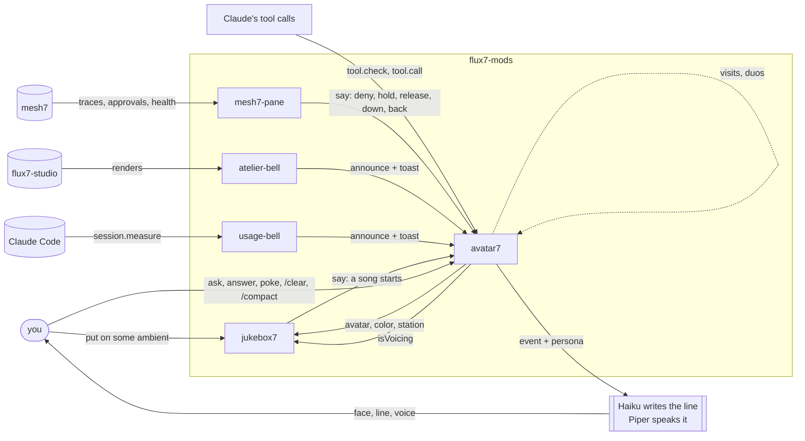

# flux7-mods

Claude Code mods: plugins of function hooks that run inside one session
(panes, bands, status line, tool-call hooks). Fleet-wide views stay in deck7;
what lives here sees a single session, from the inside, as events happen.

## How they fit together

avatar7 is the stage; the other mods are utilities that also give it
something to play. Each one does its own job alone (a pane, a toast, a
status line), and when avatar7 is loaded, what it noticed becomes a face and
a spoken line.

No mod imports another. They meet only in the session's state (`$.state`):
each writes under its own name, and whoever cares listens to the write.

| Key | Written by | Read by | Meaning |
| --- | --- | --- | --- |
| `<mod>.announce` | atelier-bell, usage-bell | avatar7 | voice my toasts, in this mood, from this event |
| `<mod>.say` | mesh7-pane, jukebox7 | avatar7 | say this now, no toast needed |
| `avatar7.avatar`, `color`, `station` | avatar7 | jukebox7 | the persona on duty, its color, its music |
| `avatar7.isVoicing` | avatar7 | jukebox7 | a line is being heard: lower the music |

The mod gives the fact; the persona gives the voice. avatar7 picks the face
from the mood, and Haiku writes the line from the event in the persona's
manner, so a new mod writes no dialogue. Every line, from a tool call, a
toast, a `say` or a poke, goes through one queue ordered by urgency: a
refusal is heard before calm news.

Unplug any mod, avatar7 included, and the others keep working; only the
voice goes. The same rule as mesh7, at the scale of a terminal: no part
commands another, and what happens is made visible.

### The loops

Four loops close through it:

- **Governance.** A call refused by mesh7 shows in mesh7-pane, which says it;
  the face frowns and the persona names the rule. A call held for a human
  makes it wait with you, then tells the decision.
- **Music.** You ask jukebox7 for music, or press the avatar's `a`, which
  plays the persona's station; each song that starts is handed back to
  avatar7, which introduces it while jukebox7 lowers the music under the
  voice (`isVoicing`), then brings it back.
- **The session.** usage-bell watches the engine's measures (context, quotas,
  memory index) and atelier-bell the studio's renders; both reach you as the
  persona's warning or good news.
- **Conversation.** You ask the persona its opinion, answer its questions,
  poke it; between calls it lives its own story and receives other personas,
  who talk to each other.

To give a new mod a voice, see
[avatar7/README.md, Giving a mod a voice](avatar7/README.md#giving-a-mod-a-voice).

## Mods

| Mod | What it does |
| --- | --- |
| `mesh7-pane` | mesh7 decisions live, polled from `localhost:9090` every 1.5 s: ALLOW / DENY / HUMAN per call with rule and parameters, approvals waiting for a human, emergency stop banner, status line counts, a toast on each new deny or approval request. In "this session" scope it shows the session's built-in calls and its MCP calls, whose traces carry the MCP connection's id, learned by matching a call to its trace. With avatar7 loaded it says refusals, holds and the human's decisions, read from the traces. Read-only. `/mesh7` opens the pane, `/mesh7 all` widens to every agent and session, `/mesh7 session` narrows back. |
| `avatar7` | A machine face that watches tool calls and comments on them in the voice of a chosen avatar (SHODAN, HAL, GLaDOS, Ada, duck7, Pod 042, Kaneda, the Commis, Fox, the Adjutant, Morte, the PDA, Lain, a Tachikoma, Nova), framed like a comm window over a backdrop of its world; it waits with you while a human decides, answers a poke, gives its opinion on the session when asked (`/avatar-ask`), reacts to the slash commands that change the session (`/clear`, `/compact`, `/rewind`...), announces the toasts of any mod that publishes an `announce` (atelier-bell, usage-bell), and speaks the `say` of any mod (mesh7-pane, jukebox7). See [avatar7/README.md](avatar7/README.md): how it works, and how to make an avatar (portrait, bake, personality). |
| `atelier-bell` | Tells you when an atelier finishes: flux7-studio renders as toasts and a status line (`studio: rendering`, `studio: last …`), `/bell` for the state. See [atelier-bell/README.md](atelier-bell/README.md). |
| `usage-bell` | Rings when the session nears a limit: context fill (70/85/95 %), the 5 h and 7 d rate-limit windows (80/95 %), the auto-memory index the engine cuts at 200 lines or 25 kB. A status line (`ctx 62% · 5h 41% · 7d 12% · mem 145/200`), `/usage7` for the detail. See [usage-bell/README.md](usage-bell/README.md). |
| `jukebox7` | Music on demand, in plain words ("put on some ambient"): YouTube audio through a hidden VLC, no browser, no focus taken. A pane with genre buttons, each a radio of artists, and the pick of the avatar on duty. See [jukebox7/README.md](jukebox7/README.md). |

## Loading

One session, one or several mods:

    claude --plugin-dir ~/flux7-mods/avatar7 --plugin-dir ~/flux7-mods/mesh7-pane --plugin-dir ~/flux7-mods/atelier-bell --plugin-dir ~/flux7-mods/usage-bell --plugin-dir ~/flux7-mods/jukebox7

Every interactive session: add the folder to `CLAUDE_CODE_PLUGIN_DIRS` in the
`env` block of `~/.claude/settings.json` (colon-separated absolute paths).
The folder is watched: saving a file reloads the mod.

When several mods open a pane at session start, the engine shows the one
opened last; the tab order follows the first opening, and reopening a pane
that is already open does not bring it forward. A mod that wants to be in
front opens its pane after `await next(e)` in `session.start`, once the
others have started, and so takes the last tab. Opening early for the first
tab and again later for the front does not work: the early open wins.

## Checking

    claude plugin validate ~/flux7-mods/avatar7
    claude plugin test ~/flux7-mods/avatar7
    npx -y -p typescript@5 tsc -p ~/flux7-mods/avatar7 --noEmit

The plugin tests mock every process; the relay's shell scripts run for real
in their own test, against a spool of their own:

    node --experimental-strip-types --test ~/flux7-mods/avatar7/tools/test_relay_shell.ts

## License

MIT, see [LICENSE](LICENSE). Character names referenced by avatar7 belong to
their owners; see the credits in [avatar7/README.md](avatar7/README.md).
